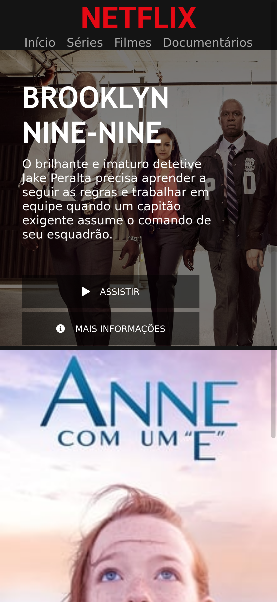

# DIO: Interface Netflix :rocket::metal:

---
# Sobre o projeto:bulb::eyes: 
Desafio: Recriar a interface do Netflix com HTML, CSS e JavaScript

## Layout mobile :triangular_ruler::mag: 

## Layout web :straight_ruler::mag: 

## Tecnologias utilizadas :wrench::dart: 
- HTML
- CSS
- JavaScript
- jQuery

## Fontes:
- https://www.themoviedb.org/ (imagens)
- https://fontawesome.com/kits/ff99aa81cd/use?welcome=yes (icones)
- https://owlcarousel2.github.io/OwlCarousel2/ (carrossel de imagens)
- https://fonts.google.com/specimen/Roboto?category=Sans+Serif (fonte "Roboto")

